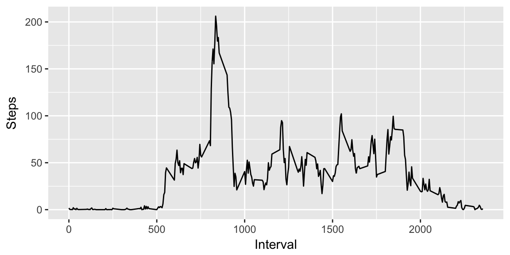
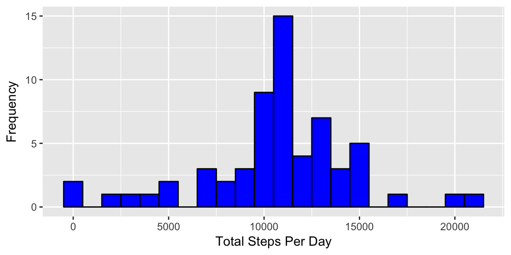
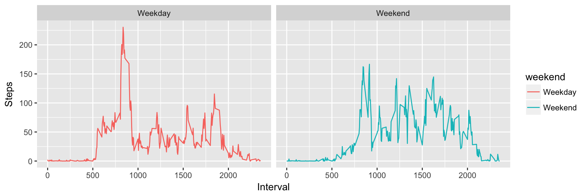

#Reproducible Research Course Project 1
By David English

##Initialisation
The first step is to ensure the correct libraraies are loaded. These are loaded using the following code.


```r
library(dplyr)
library(data.table)
library(ggplot2)
library(lubridate)
library(chron)
```

##1. Loading the Data
Create a data table named *activity* that contains the data in the activity.csv file. The date column is subsequently transformed into a date format, rather than a character string.

```r
activity <- fread("activity.csv") %>%
      mutate(date = ymd(date))
```
The data is reformed to include only those rows with complete cases (i.e., no NAs). This is then grouped by day and then a new data frame is created that summarises the data, giving the  sum of steps, the mean, and the median for each day.

```r
activity_by_day <- filter(activity, complete.cases(activity)) %>%
      group_by(date) %>%
      summarise(sums = sum(steps, na.rm = TRUE))
```


##2. Number of Steps Per Day
A histogram of the total number of steps by each day.


```r
ggplot(activity_by_day, aes(x = sums)) + 
      geom_histogram(binwidth = 1000, col = "black", fill = "blue") +
      labs(x = "Total Steps Per Day", y = "Frequency")
```


##3. Mean and Median Number of Steps Per Day

```r
mean_steps <- as.integer(mean(activity_by_day$sums, na.rm = TRUE))
median_steps <- median(activity_by_day$sums, na.rm = TRUE)
```
The **mean** of the number of steps taken per day is 10766.  
The **median** of the number of steps taken per day is 10765.

##4. Average Steps 

Create a new data set that groups the data by the interval of the day across all days.

```r
activity_by_interval <- filter(activity, complete.cases(activity)) %>%
      group_by(interval) %>%
      summarise(mean = mean(steps))
```


```r
ggplot(activity_by_interval, aes(x = interval)) +
      geom_line(aes(y = mean)) +
      labs(x = "Interval", y = "Steps")
```



##5. Interval with Max Steps on Average

```r
interval_max <- activity_by_interval$interval[which.max(activity_by_interval$mean)]
```

The interval that on average has the **maximum** number of steps is 835.  

##6. Imputing Missing Values

Create a vector of where the missing values are in the data set.

```r
missing_vals <- is.na(activity$steps)
```
There are 2304 missing data points in the **activity** data set.  

Find the 5 minute interval of the day that the missing value corresponds to and then create a matching vector of the average steps taken for that interval.

```r
missing_int <- activity$interval[missing_vals]
imputed_vals <- sapply(missing_int, function(x) {
      activity_by_interval$mean[which(activity_by_interval$interval == x)]})
```
This can then be used to impute the missing values in a new data set.

```r
activity_imputed <- activity
activity_imputed$steps[missing_vals] <- imputed_vals
```
This new data set with imputed values now needs to be grouped by the date and summarised to give the mean again.

```r
imputed_by_date <- group_by(activity_imputed, date) %>%
                  summarise(sums = sum(steps))
```
This is then used to make the histogram of the average number of steps per day.

```r
ggplot(imputed_by_date, aes(x = sums)) +
      geom_histogram(binwidth = 1000, col = "black", fill = "blue") +
      labs(x = "Total Steps Per Day", y = "Frequency")
```




```r
imputed_mean <- as.integer(mean(imputed_by_date$sums))
imputed_median <- as.integer(median(imputed_by_date$sums))
```
The **mean** number of steps taken per day after the missing values have been imputed is 10766.  
The **median** number of steps taken per day after the missing values have been imputed is 10766.  

These values are almost identical to thos computed before the missing values were imputed. This makes sense as the missing values were replaced by the mean values of the other data. However, the frequency of the values in the histogram are in general higher, which is consistent with more values being present in the imputed data set.

##8. Steps on Weekends vs Weekdays

Add a column to the imputed **activity** data frame for whether the date is a weekend or a weekday. This column will store this information as a factor with the levels, "Weekday" and "Weekend". This is then grouped by both the interval and "Weekend" and summarised as the mean of these groups.

```r
activity_imputed <- mutate(activity_imputed, 
                           weekend = as.factor(ifelse(is.weekend(date), 
                                                      "Weekend", 
                                                      "Weekday")))
imputed_by_weekend <- group_by(activity_imputed, interval, weekend) %>%
                        summarise(mean = mean(steps))
```
The mean steps taken at each interval over all days is displayed by weekend or weekday.

```r
ggplot(imputed_by_weekend, aes(x = interval, y = mean, colour = weekend)) +
      geom_line() +
      facet_grid(~ weekend) +
      labs(x = "Interval", y = "Steps")
```


